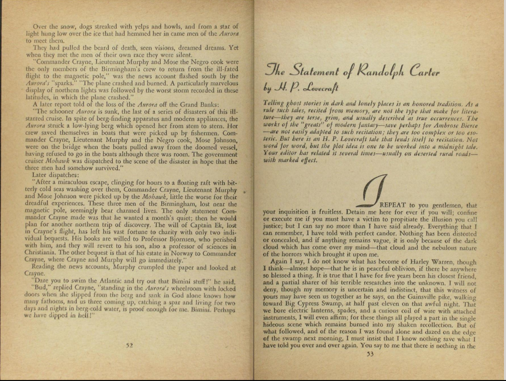

#Textual Encoding Workshop

The goal of this workshop is to introduce students to marking up documents with structured markup languages like [TEI P5](http://www.tei-c.org/Guidelines/P5/) and [JATS](http://jats.nlm.nih.gov/).

##Text Encoding Initiative

Let's consider how to markup H.P. Lovecraft's short story, ["The Statement of Randolph Carter"](https://en.wikisource.org/wiki/Avon_Fantasy_Reader/Issue_10/The_Statement_of_Randolph_Carter). How would you represent this document as [plain text](TEI/Randolph_Carter.txt), [HTML](TEI/Randolph_Carter.html), [ePub](TEI/Randolph_Carter.epub)? Here's how it might be rendered in very simple [TEI](TEI/randolph-carter.xml). How could we improve its representation?

##Journal Article Tagging Suite

The Journal Article Tagging Suite or [JATS](http://jats.nlm.nih.gov/) is a set of three schemas for marking up journal articles and scholarly books. Here is a [sample article](JATS/journal.pbio.1002402.XML) marked up with JATS. Interestingly, all the articles in [PLOS](https://www.plos.org/) can be downloaded in JATS format. Here's [a tar file with a whole bunch of PLOS articles](JATS/pbio-xml.tgz). The [Open Library of the Humanities](https://olh.openlibhums.org/) also provides articles in JATS format for download.
